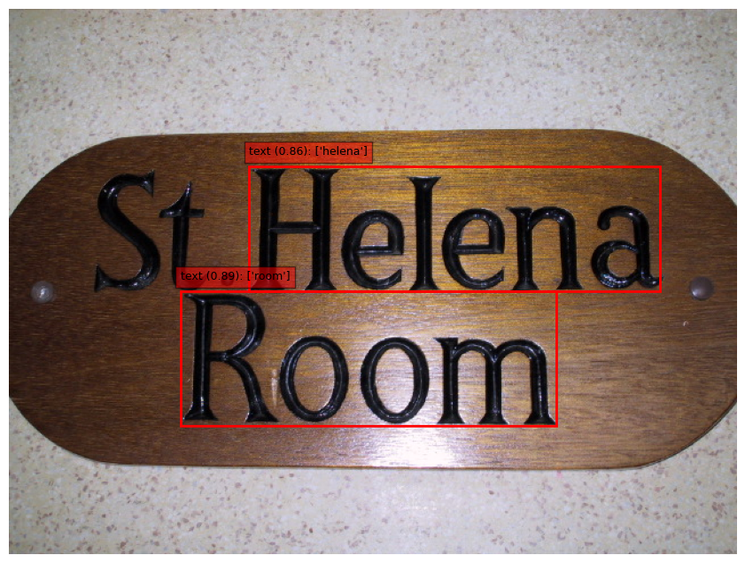
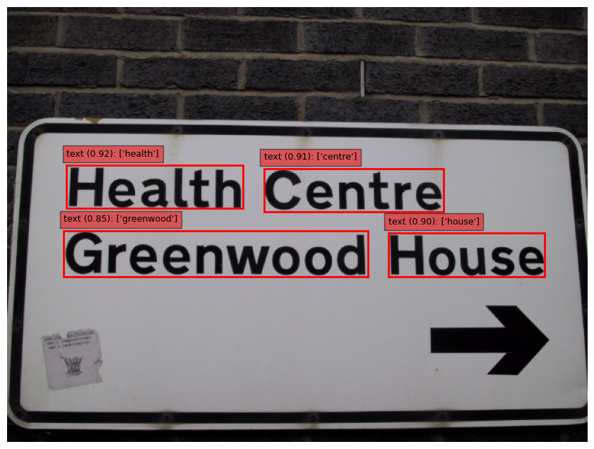

# Scene-Text-Recognition (STR) Project 
**Author**: **Quang-Huy Tran, Student at HCMC University of Technology, VNU-HCM**  
*Implement a Scene Text Recognition (STR) system designed to detect and recognize textual information from natural images.*  
This system follows a **two-stage approach** where a **text detection model** first localizes text regions in the image, and the cropped regions are then fed into a **CRNN model** to recognize the corresponding text sequences.

## Text Detection Results
**Text Detection Model (ICDAR2003 Training):** https://huggingface.co/huytqvn/text-detection-str-pipeline   
  
  
  <p align="center">
  
  </p>

## Text Recognition Results

**Text Recognition Model (CRNN):** https://huggingface.co/huytqvn/text-recognition-pipeline

  <p align="center">
  
  </p>

## Deployment
The system is deployed using a service-oriented architecture composed of three main components:
- **Ray Serve** for scalable model serving.
- **FastAPI** for exposing REST APIs.
- **Streamlit** for an interactive user interface.
The OCR pipeline is deployed as a Ray Serve application, while FastAPI acts as the API gateway and Streamlit provides a frontend for users to upload images and visualize recognition results.

### Setup Environment

Create a Python virtual environment and install all required dependencies.

```bash
python -m venv .venv
source .venv/bin/activate
pip install -r requirements.txt
```

### Run Server
Initialize the serving environment and start the backend infrastructure.
```bash
cd deployment
make init
```
Deploy the OCR pipeline using Ray Serve.
```bash
cd deployment
make deploy_ocr
```
Launch the web interface.
```bash
cd deployment
make streamlit
```
Once the system is running, the following services will be available:

### Available Services

Once the system is running, the following services will be available:

- **Ray Dashboard**: `http://localhost:8265`  
- **FastAPI Swagger Documentation**: `http://localhost:8000/docs`  
- **Streamlit User Interface**: `http://localhost:8501`


## Final Results
  <table align="center">
  <tr>
  <tr>
  <td></td>
  </tr>
  <tr>
  <td></td>
  </tr>
  </table>


